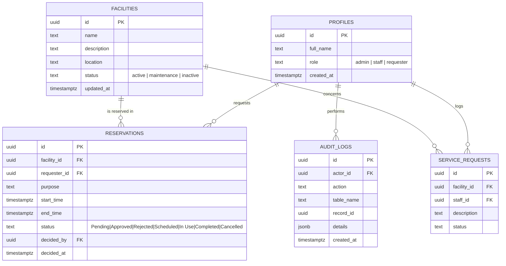
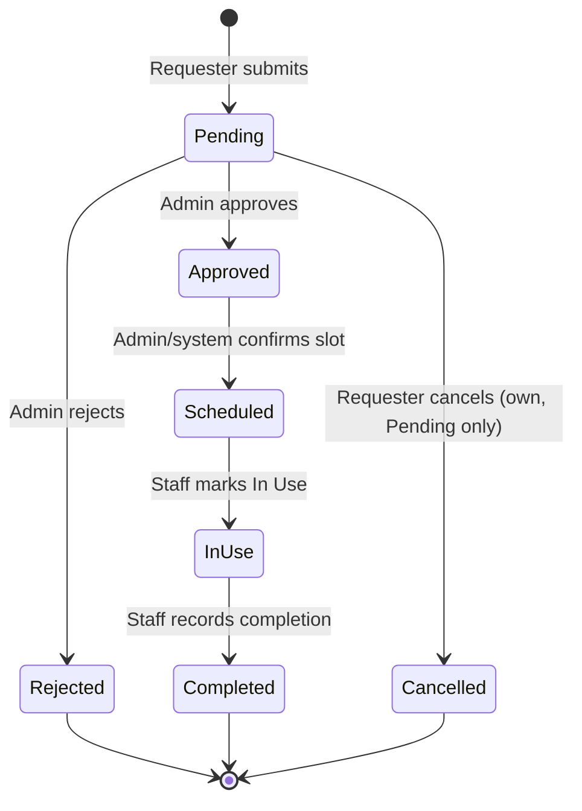

# Role-Based Facility Reservation and Approval System
**Laboratory 4 – Section B | Systems Analysis and Design**

Stack: **GitHub Pages** (static frontend) + **Supabase** (Auth, Postgres, RLS, triggers)

---

## 1. GitHub Repository & Live URL

| Item | Value |
|---|---|
| GitHub repository URL | `https://github.com/<your-username>/facility-reservation-system` |
| Live GitHub Pages URL | `https://<your-username>.github.io/facility-reservation-system/` |

*(Fill in after you push and enable Pages — steps in Section 8.)*

---

## 2. Updated ERD



## 3. Use Case Diagram

```mermaid
flowchart LR
    Requester((Requester))
    Staff((Facility Staff))
    Admin((Administrator))

    subgraph System["Facility Reservation & Approval System"]
        UC1([View Facilities])
        UC2([Submit Reservation])
        UC3([View Own Reservation Status])
        UC4([Cancel Own Pending Reservation])
        UC5([View Reservation History])
        UC6([View Reservations])
        UC7([Confirm Facility Usage - In Use])
        UC8([Record Completion])
        UC9([Create Service Request])
        UC10([Update Facility Condition])
        UC11([Manage Facilities])
        UC12([Manage Users/Roles])
        UC13([Approve / Reject Reservation])
        UC14([View Service Concerns & Reports])
        UC15([View Audit Logs])

    Requester --> UC1
    Requester --> UC2
    Requester --> UC3
    Requester --> UC4
    Requester --> UC5

    Staff --> UC1
    Staff --> UC6
    Staff --> UC7
    Staff --> UC8
    Staff --> UC9
    Staff --> UC10

    Admin --> UC1
    Admin --> UC11
    Admin --> UC12
    Admin --> UC13
    Admin --> UC14
    Admin --> UC15
    end
```



---

## 4. Role-Permission Matrix

| Function | Administrator | Facility Staff | Requester |
|---|:---:|:---:|:---:|
| View facilities | ✅ | ✅ | ✅ |
| Manage facilities (add/update/deactivate) | ✅ | ⚪ update condition only | ❌ |
| Manage user accounts | ✅ | ❌ | ❌ |
| Submit reservation request | ❌ | ❌ | ✅ |
| View own reservation status/history | ❌ | ❌ | ✅ |
| Cancel own **Pending** reservation | ❌ | ❌ | ✅ |
| View all reservations | ✅ | ✅ | ❌ (own only) |
| Approve / reject reservation | ✅ | ❌ | ❌ |
| Mark facility **In Use** | ❌ | ✅ | ❌ |
| Record **Completion** | ❌ | ✅ | ❌ |
| Create service requests | ❌ | ✅ | ❌ |
| View service concerns & reports | ✅ | ⚪ own logs | ❌ |
| View audit logs | ✅ | ❌ | ❌ |

Enforced at two layers:
1. **UI layer** – tabs/actions are only rendered for the logged-in role (`index.html`, `TAB_DEFS`).
2. **Database layer (RLS)** – Postgres Row Level Security policies in `schema.sql` re-check the role on every query, so the rule holds even if someone bypasses the UI.

---

## 5. Reservation Workflow



Required statuses implemented: `Pending, Approved, Rejected, Scheduled, In Use, Completed, Cancelled` (see `reservations.status` check constraint in `schema.sql`).

---

## 6. Business Rules — Implementation Map

| ID | Rule | Where it's enforced |
|---|---|---|
| BR-B4-01 | Only active facilities may be reserved | Trigger `enforce_reservation_rules()` checks `facilities.status = 'active'` |
| BR-B4-02 | Start must precede end | `chk_start_before_end` CHECK constraint on `reservations` |
| BR-B4-03 | Overlapping approved schedules prohibited | `enforce_reservation_rules()` overlap query using `tstzrange(...) &&` |
| BR-B4-04 | Only Administrator may approve | RLS policy `reservations_update_admin` (`current_role() = 'admin'`) |
| BR-B4-05 | Rejected cannot become Scheduled | Trigger blocks `Rejected → anything except Cancelled` |
| BR-B4-06 | Approved reservations reserve the slot | Same overlap check includes `Approved` status |
| BR-B4-07 | Completed reservations cannot be edited | Trigger raises exception if `old.status = 'Completed'` |
| BR-B4-08 | Maintenance facilities cannot be reserved | Same check as BR-01 (`status <> 'active'` blocks insert) |
| BR-B4-09 | Requesters modify only their own Pending requests | RLS policy `reservations_update_requester_own_pending` |
| BR-B4-10 | Approval/status changes must be logged | Trigger `audit_reservation_changes()` writes to `audit_logs` |

---

## 7. Audit Trail

`audit_logs` records:
- `RESERVATION_SUBMITTED`
- `RESERVATION_STATUS_CHANGED` (approval, rejection, cancellation, scheduling, in-use, completion)
- `FACILITY_UPDATED`, `FACILITY_DELETED`

Writes go through a `SECURITY DEFINER` function (`write_audit_log`) so normal users cannot forge or delete log entries; only Administrators can **read** the table (`audit_logs_select_admin` policy).

📸 **Audit-log screenshot**: after testing, open the *Audit Log* tab as an Administrator and take a screenshot showing at least one submission and one status-change entry. Save it as `audit-log-screenshot.png` in this repo and embed it here:

```md

```

---

## 8. Setup & Deployment

### A. Create the Supabase backend
1. Go to [supabase.com](https://supabase.com) → New Project.
2. Open **SQL Editor** → paste the entire contents of `schema.sql` → **Run**.
3. Go to **Project Settings → API** → copy your **Project URL** and **anon public key**.
4. In `index.html`, replace:
   ```js
   const SUPABASE_URL = "https://YOUR-PROJECT-REF.supabase.co";
   const SUPABASE_ANON_KEY = "YOUR-ANON-PUBLIC-KEY";
   ```
5. (Optional) In **Authentication → Providers**, disable "Confirm email" while testing so accounts are usable immediately.

### B. Create test accounts and promote roles
1. Open the deployed app (or `index.html` locally) → **Create account** for 3 users (one intended admin, one staff, one requester).
2. In Supabase **Table Editor → profiles**, find each user's row and edit `role` to `admin`, `staff`, or `requester` respectively (all new sign-ups default to `requester`).

### C. Push to GitHub
```bash
git init
git add .
git commit -m "Lab 4B: role-based facility reservation and approval system"
git branch -M main
git remote add origin https://github.com/<your-username>/facility-reservation-system.git
git push -u origin main
```

### D. Enable GitHub Pages
1. Repo → **Settings → Pages**.
2. Source: **Deploy from a branch** → Branch: `main`, folder `/ (root)`.
3. Save; your live URL appears at the top of that page after a minute (`https://<your-username>.github.io/<repo>/`).

---

## 9. Functional Test Results

| Test ID | Scenario | Steps | Expected Result | Actual Result |
|---|---|---|---|---|
| TC-B4-01 | Requester submits reservation | Sign in as requester → New Request → submit | Saved as **Pending** | ⬜ Pass / ⬜ Fail |
| TC-B4-02 | Submit overlapping schedule | Try to reserve a slot that overlaps an existing Approved/Scheduled reservation | Conflict detected and blocked (DB error surfaced in UI) | ⬜ Pass / ⬜ Fail |
| TC-B4-03 | Administrator approves request | Sign in as admin → Approvals → Approve → Confirm Schedule | Status becomes **Approved** → **Scheduled** | ⬜ Pass / ⬜ Fail |
| TC-B4-04 | Administrator rejects request | Approvals → Reject | Status becomes **Rejected** | ⬜ Pass / ⬜ Fail |
| TC-B4-05 | Staff marks facility In Use | Sign in as staff → Operations → Mark In Use | Status updated to **In Use** | ⬜ Pass / ⬜ Fail |
| TC-B4-06 | Staff completes reservation | Operations → Mark Completed | Status becomes **Completed** | ⬜ Pass / ⬜ Fail |
| TC-B4-07 | Requester edits another user's request | Attempt update via another account/API call | Blocked by RLS (`reservations_update_requester_own_pending`) | ⬜ Pass / ⬜ Fail |
| TC-B4-08 | Reserve facility under maintenance | Try to submit a request for a Maintenance-status facility | Blocked by trigger (`enforce_reservation_rules`) | ⬜ Pass / ⬜ Fail |
| TC-B4-09 | Check audit log | Admin → Audit Log tab | Approval/status log entries visible | ⬜ Pass / ⬜ Fail |
| TC-B4-10 | Open protected page without login | Load app without signing in | Redirected to sign-in screen; no data loads (RLS requires `auth.uid()`) | ⬜ Pass / ⬜ Fail |

*Check off each box after you run the test in your own deployment, and attach screenshots per test if your instructor requires them.*

---

## 10. Project Structure

```
facility-reservation-system/
├── index.html      # Full frontend (auth + role-based views)
├── schema.sql       # Supabase schema, RLS policies, triggers, audit log
└── README.md        # This document (ERD, use case, matrix, rules, tests)
```
